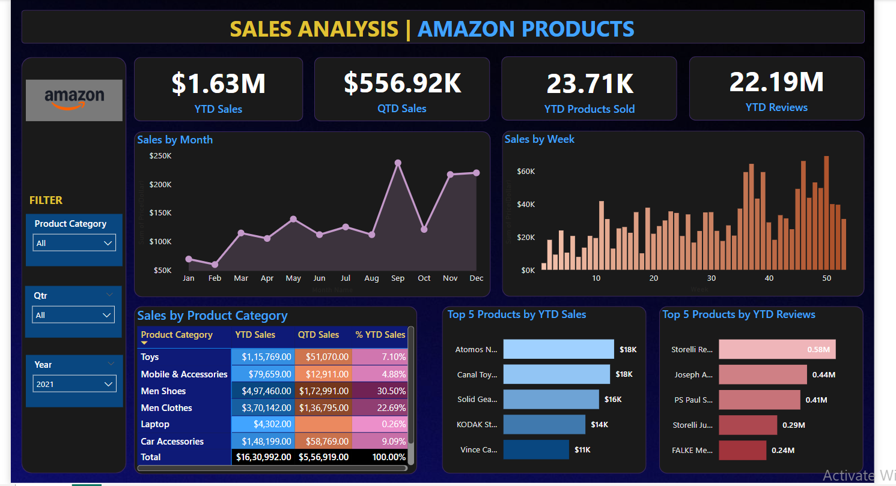

# Amazon-Sales-Dashboard
# 🛒 Amazon Sales Dashboard – Power BI Project

This is a Power BI dashboard project built to analyze Amazon sales performance using data imported directly from an Excel file.

## 📊 Key Features:
- KPIs: Year-to-Date (YTD) Sales, Quarter-to-Date (QTD) Sales, Products Sold, and Review Count
- Dynamic filters for Year, Quarter, and Product Category
- Sales trend analysis (Monthly & Weekly)
- Top-selling products and categories with highest reviews
- Clean and interactive user interface for better data storytelling

## 📁 Data Source:
- **Excel File (Amazon_Combined_Data.xlsx)** loaded using **Power BI's Get Data feature**

## 🛠️ Tools & Technologies Used:
- Power BI Desktop (v2.128+)
- DAX (for creating calculated columns and measures)
- Excel (for initial data storage and structure)

## 🧠 Key Insights:
- Sales volume and revenue consistently rise during Q4, indicating strong seasonal impact
- Electronics and Home categories dominate in both sales and reviews
- Weekly trends show steady performance post product launches and promotions

## 📷 Dashboard Preview:

## 📂 Files Included:
- `.pbix` file – Power BI Dashboard project file
- Excel dataset 
- Dashboard screenshot
- README documentation (this file)

---

🔍 **About Me**  
I’m a Power BI Developer with skills in data visualization, dashboard design, and business intelligence. I’m currently **looking for Power BI / Data Analyst opportunities**.

Let’s connect on [LinkedIn](https://linkedin.com/in/prabhuji-dwivedi-shubhanshu-08a563259) if you're hiring or want to collaborate.

